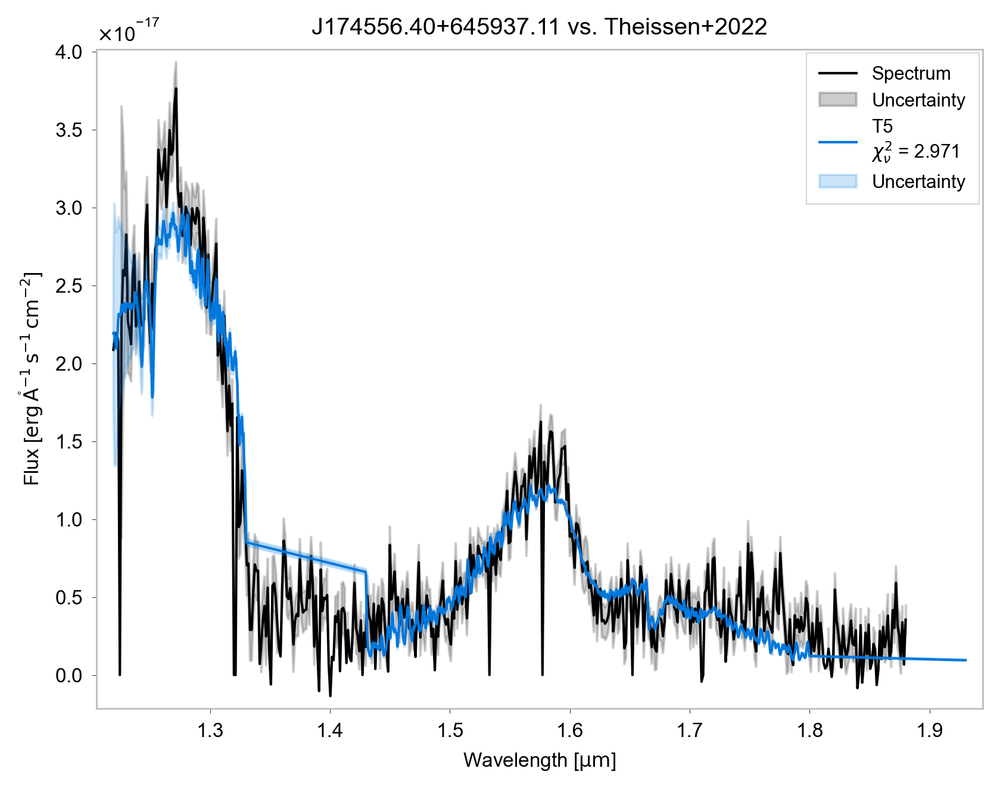

# Euclid Tools

## Introduction

The **Euclid Tools** package is a collection of Python utilities designed to work with data retrieved from the Euclid mission's archives. The tools are divided into two versions: one pulling data from the **IRSA (Infrared Science Archive)** and the other from **ESA (European Space Agency)**. While both versions provide the same core functionality, the **ESA services** are faster than the IRSA services and should be preferred when available.

The tools allow users to:
- Retrieve catalog objects, spectra, and image cutouts.
- Compare observed spectra to predefined templates.
- Visualize spectra and images (RGB composites).
  
## Functionality Overview

### 1. Data Retrieval

The core functionality of the Euclid Tools package is to retrieve data from the Euclid archives. This includes:
- **Catalog Objects**: Retrieve astronomical objects based on coordinates (RA, Dec) and search radius.
- **Spectra**: Retrieve spectra for objects identified in the catalog.
- **Cutouts**: Retrieve image cutouts for a specific region around a given object and band (e.g., VIS, Y, J, H).

There are two versions of the data retrieval tools:
- **IRSA Version**: Located in `tools/irsa_tools.py`. These functions retrieve data from the IRSA archive.
- **ESA Version**: Located in `tools/esa_tools.py`. These functions retrieve data from the ESA archive and are faster.

### 2. Spectrum Comparison

The toolset includes a specialized comparison tool using the `fluxcomp` package to compare observed spectra to template models. The comparison metrics, such as reduced chi-squared, can help assess the quality of the fit between the observed spectrum and the templates.

### 3. Plotting

The package includes utilities for plotting:
- **Spectra**: Plot observed spectra with error bars and uncertainties.
- **Images**: Plot individual images and combine them into RGB composites.

## Detailed Description

### Folder Structure:
The toolset consists of several scripts and modules:
- **`compare_spectrum_example.py`**: Example script to compare a spectrum with template SEDs.
- **`esa_tools_example.py`**: Example script for retrieving and plotting data from the ESA archive.
- **`irsa_tools_example.py`**: Example script for retrieving and plotting data from the IRSA archive.
- **`tools/esa_tools.py`**: Contains functions for interacting with the ESA archive.
- **`tools/irsa_tools.py`**: Contains functions for interacting with the IRSA archive.
- **`tools/image_plotter.py`**: Functions for plotting image cutouts.
- **`tools/spectrum_plotter.py`**: Functions for plotting spectra.
- **`tools/shared.py`**: Shared utility functions used across the toolset.
- **`fluxcomp/core.py`**: Core functions for spectrum comparison.

### 1. `retrieve_objects()`

Located in `tools/esa_tools.py` or `tools/irsa_tools.py` depending on which version is used.

This function allows users to retrieve catalog objects from the Euclid archive based on coordinates and a specified search radius.

#### Parameters:
- `ra`: Right Ascension of the target object.
- `dec`: Declination of the target object.
- `search_radius`: Radius (in arcseconds) around the target to search for objects.

#### Returns:
- A list of objects that are found within the specified search radius.

### 2. `retrieve_spectrum()`

Located in `tools/esa_tools.py` or `tools/irsa_tools.py`.

This function retrieves the spectrum of a given object from the Euclid archive based on the object ID. It also allows users to mask bad data points (e.g., those with erroneous error values) to improve the comparison accuracy.

#### Parameters:
- `object_id`: The unique identifier of the object.
- `maskType`: A type of mask to apply to the spectrum data (e.g., `MaskType.ERROR`).

#### Returns:
- A table containing the spectrum data, including wavelength, flux, and error.

### 3. `retrieve_cutout()`

Located in `tools/esa_tools.py` or `tools/irsa_tools.py`.

This function retrieves an image cutout for a given region around the target object and specified band (e.g., VIS, Y, J, H).

#### Parameters:
- `ra`: Right Ascension of the target object.
- `dec`: Declination of the target object.
- `search_radius`: Radius (in arcseconds) to define the region of interest.
- `cutout_size`: Size (in arcseconds) of the cutout.
- `band`: The band (e.g., "VIS", "Y", "J", "H") to retrieve.

#### Returns:
- A data object (HDUs) containing the image cutout for the specified band.

### 4. `plot_spectrum()`

Located in `tools/spectrum_plotter.py`.

This function generates a plot of the observed spectrum for a given object. The plot includes both the flux and error values, allowing users to visualize the spectrum and uncertainties.

#### Parameters:
- `data`: The spectrum data (including wavelength, flux, and error).
- `ra`: Right Ascension of the target object.
- `dec`: Declination of the target object.
- `output_dir`: Directory where the plot will be saved.
- `open_plot`: Whether to open the plot file after saving.
- `plot_format`: The format of the plot (e.g., "pdf", "png").

#### Returns:
- A saved plot of the spectrum.

### 5. `plot_images()`

Located in `tools/image_plotter.py`.

This function generates plots for multiple images (cutouts) of the object in different bands (e.g., VIS, Y, J, H). The images can be combined into RGB composites.

#### Parameters:
- `ra`: Right Ascension of the target object.
- `dec`: Declination of the target object.
- `images`: A list of dictionaries containing image data for each band.
- `img_size`: The size of the image cutout (in arcseconds).
- `image_contrast`: Contrast level to adjust the image brightness.
- `output_dir`: Directory where the plot will be saved.
- `open_plot`: Whether to open the plot file after saving.
- `plot_format`: The format of the plot (e.g., "pdf", "png").

#### Returns:
- A saved plot of the RGB images.

### 6. Spectrum Comparison Using `fluxcomp`

Located in `fluxcomp/core.py`.

To compare an observed spectrum to a template, the `fluxcomp` package is used. The script leverages the `SED` and `WaveFlux` classes for the comparison, employing metrics such as reduced chi-squared.

#### Key steps:
1. Retrieve the catalog object based on RA, Dec.
2. Retrieve the spectrum for the object.
3. Retrieve template(s) for comparison (e.g., from "Theissen+2022").
4. Trim the spectrum to a specific wavelength range.
5. Compare the spectrum to the templates using the reduced chi-squared metric.
6. Plot the comparison.

## Example Usages

### Example 1: Retrieving and Plotting a Spectrum

This example demonstrates how to retrieve a spectrum for an object and plot it using the `plot_spectrum` function. The full example code can be found in `esa_tools_example.py`.

```python
from tools.esa_tools import retrieve_objects, retrieve_spectrum
from tools.spectrum_plotter import plot_spectrum

# Define object coordinates
ra, dec = 266.4850113, 64.9936424

# Search radius (arcsec)
search_radius = 5

# Retrieve object data from ESA
results = retrieve_objects(ra, dec, search_radius)

if results:
    result = results[0]
    object_id = str(result["object_id"])

    # Retrieve spectrum data
    spectrum_data = retrieve_spectrum(object_id)

    # Plot the spectrum
    plot_spectrum(spectrum_data, ra, dec, output_dir=".", plot_format="pdf")
else:
    print("No object found for the given coordinates and radius.")
```


### Example 2: Retrieving and Plotting Image Cutouts

This example shows how to retrieve image cutouts for a given object using different bands, and plot them using the `plot_images` function. The full example code can be found in `esa_tools_example.py`.

```python
from tools.esa_tools import retrieve_cutout
from tools.image_plotter import plot_images

# Define object coordinates and cutout size (arcsec)
ra, dec = 266.4850113, 64.9936424
cutout_size = 20  # arcsec

# Retrieve image cutouts for different bands
search_radius = 5  # arcsec
vis_hdu = retrieve_cutout(ra, dec, search_radius, cutout_size, "VIS")
y_hdu = retrieve_cutout(ra, dec, search_radius, cutout_size, "Y")
j_hdu = retrieve_cutout(ra, dec, search_radius, cutout_size, "J")
h_hdu = retrieve_cutout(ra, dec, search_radius, cutout_size, "H")

# Prepare the images list for plotting
images = [
    {"hdu": vis_hdu, "band": "VIS", "rgb": "b"},
    {"hdu": y_hdu, "band": "Y", "rgb": "g"},
    {"hdu": j_hdu, "band": "J", "rgb": None},
    {"hdu": h_hdu, "band": "H", "rgb": "r"},
]

# Plot the images in a single figure
plot_images(ra, dec, images, cutout_size, plot_format="pdf")
```


### Example 3: Compare Spectrum to Template Using Fluxcomp

This example demonstrates how to use the Euclid tools to retrieve a spectrum for a given object
and compare it to predefined templates using the `fluxcomp` tool. The full example code can be found in `compare_spectrum_example.py`.

```python
from fluxcomp.core import SED, WaveFlux, TemplateProvider
from tools.esa_tools import retrieve_spectrum
from tools.shared import MaskType

# Retrieve spectrum for an object
data = retrieve_spectrum(object_id, maskType=MaskType.ERROR)

# Retrieve templates for comparison
template_name = "Theissen+2022"
provider = TemplateProvider()
templates = provider.get_Theissen_2022_templates(smooth_window=10)

# Create a WaveFlux object and trim the spectrum
spectrum = WaveFlux(
    label="Spectrum", wavelength=data["WAVELENGTH"], flux=data["FLUX"], uncertainty=data["ERROR"]
)
spectrum.trim(1.22, 1.88)  # Trim to a specific wavelength range

# Compare the spectrum to the templates
sed = SED("Object vs. " + template_name)
sed.compare(spectrum, templates, trim_wave=True, metric="reduced-chi2")
sed.to_flux_lambda()
sed.plot(reference_on_top=False, spec_uncertainty=True)
```


